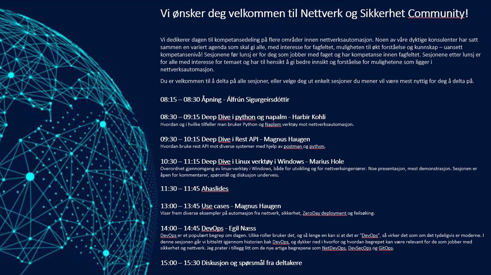

# Nettverk og Sikkerhets Community dag Q1-2021

## Recordings:

[Deep dive i Python og Napalm - Harbir Kohli](https://web.microsoftstream.com/video/35c27549-9f60-4357-b925-88548fc59271)  
  
[Deep dive i RestAPI - Magnus Haugen](https://web.microsoftstream.com/video/20972bf0-8708-4892-864c-ab9721c82997)  
  
[Deep dive i Linux verktøy i Windows - Marius Hole](https://web.microsoftstream.com/video/53b338ba-415b-4a55-b342-4d4f03a8d70a)  
  
[Automation use cases - Magnus Haugen](https://web.microsoftstream.com/video/e52fbe0b-3705-491c-8b3b-e77073d29cc8)  
  
[DevOps - Egil Næss](https://web.microsoftstream.com/video/4ee2ce8d-c03d-4de5-829d-fc1c88ac01b6)  